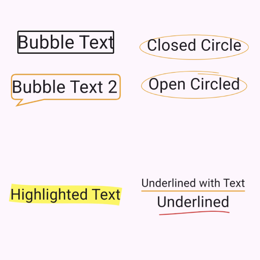
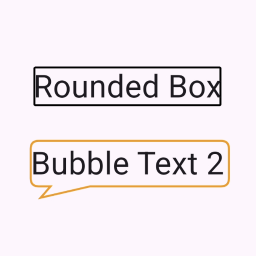
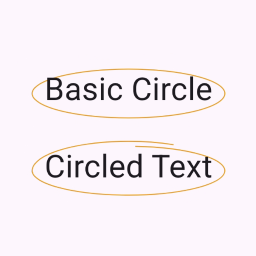
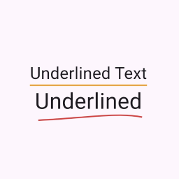
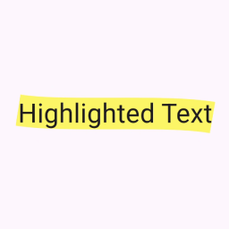

# flutter_text_decorator


<!--  -->
<!-- [](https://pub.dev/packages/flutter_tex_dec) -->



Bring your words to life leveraging flutter_text_decorator with wavy underlines, colorful boxes, speech bubbles and more. Whether you want to highlight important details, add a playful touch or simply stand out. The package makes it easy to add personality and flair to your text.

## Features

- [x] Boxes
- [x] Underline
- [x] Wavy Box
- [x] Speech Bubble

Feel free to check out the [Example App](./example) and play around.

## Installation

### pub.dev

Add flutter_text_decorator as dependency to `pubspec.yaml`:

```
dependencies:
  flutter_tex_dec: ^0.1.0
```

## Usage

### Box Decorator

```
TextDrawDecorator.boxed(
  style: BoxStyle.rounded,
  text: const Text(
    'Rounded Box',
    style: TextStyle(fontSize: 32),
  ),
  strokeWidth: 2,
),
```



### Circle Decorator

```
TextDrawDecorator.circled(
  style: CircleStyle.circled,
  text: const Text(
    'Circled Text',
    style: TextStyle(fontSize: 32),
  ),
),
```



### Underline Decorator

```
TextDrawDecorator.underlined(
  style: UnderlineStyle.horizontal,
  text: const Text(
    'Underlined Text',
    style: TextStyle(fontSize: 24),
  ),
  color: Colors.orange,
  strokeWidth: 2,
),
```



### Highlight Decorator

```
TextDrawDecorator.highlighted(
  style: HighlightStyle.marker,
  text: const Text(
    'Highlighted Text',
    style: TextStyle(fontSize: 32),
  ),
),
```



## Roadmap

### TODO's

- [ ] Fix Wavy Box corners
- [ ] Add test automation

### Planned features

- [ ] Comic effect

## Contributing

See [CONTRIBUTING](./CONTRIBUTING.md)

## Authors and acknowledgment

Authors:

- [Tobias Rump](https://github.com/TobiasRump)
- [Jonas Klock](https://github.com/jay-k98)

Special Thanks:

- Noah Bauer for the creative name of this package

## License

See [LICENSE](./LICENSE)
